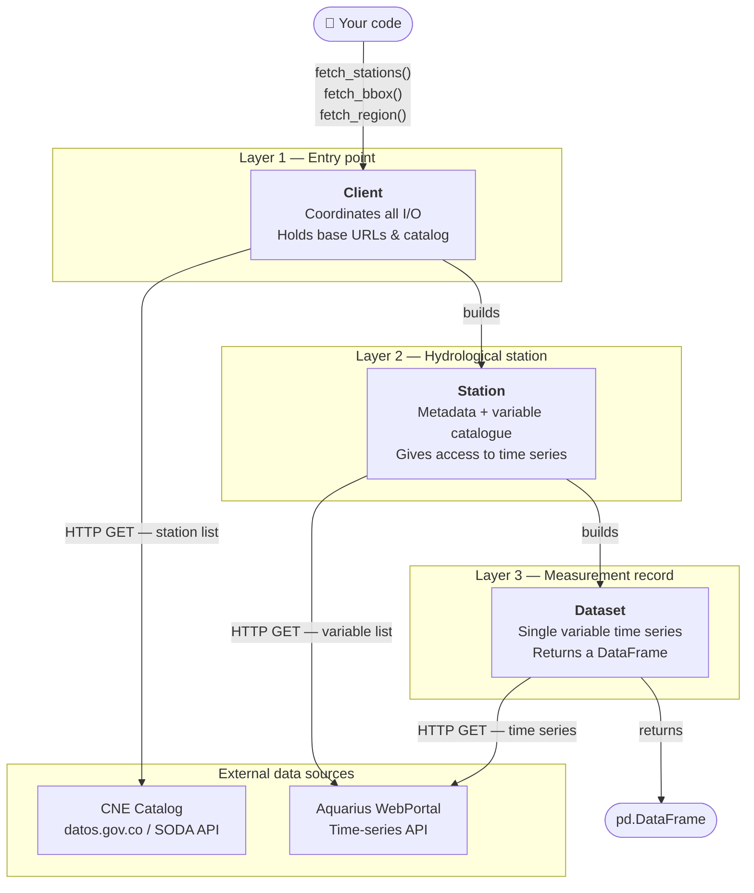

# Architecture

This page explains the internal design of `colombia-hydrodata` — how the three
main layers relate to each other and how a single API call eventually hands you
a pandas / geopandas DataFrame ready for analysis.

---

## The Three-Layer Hierarchy



!!! info "Mermaid diagrams"
Material for MkDocs renders Mermaid diagrams automatically when you add
`mermaid` to the `markdown_extensions` list in `mkdocs.yml`. See the
[Material docs](https://squidfunk.github.io/mkdocs-material/reference/diagrams/)
for setup instructions.

---

## Layer 1 — `Client`

`Client` is the single object your code instantiates. It is responsible for:

- Holding the base URLs for the CNE catalog (datos.gov.co) and the Aquarius WebPortal.
- Fetching and caching the **CNE catalog** as a `GeoDataFrame` at construction time.
- Performing spatial and list-based station lookups, returning either `GeoDataFrame`
  slices (lightweight helpers) or fully hydrated `Station` objects.

```python
# Simplified internal flow of Client.fetch_station()

# 1. Look up station_id in client.catalog (already in memory)
# 2. Call station_data(), station_location_data(), station_hydrographic_data()
# 3. Call station_datasets() via Aquarius WebPortal
# 4. Construct and return a frozen Station dataclass
```

!!! tip "Lightweight vs full fetch"
`Client.stations_in_list()` and `Client.stations_in_region()` skip Step 2–4
entirely — they return a GeoDataFrame slice directly from `client.catalog`
without making any additional network calls. Use these when you only need
station locations or metadata.

---

## Layer 2 — `Station`

`Station` is a **frozen dataclass** populated once at construction time. When
`Client.fetch_station()` is called, it immediately fetches all metadata from
the CNE catalog, the Aquarius variable list, and stores everything in a single
immutable object — there is no lazy loading.

| Attribute / method                    | What it gives you                           | Network call? |
| ------------------------------------- | ------------------------------------------- | :-----------: |
| `.id`, `.name`, `.category`, …        | CNE metadata fields                         |      ❌       |
| `.location`                           | `Location` (altitude, lon, lat)             |      ❌       |
| `.hydrographic`                       | `Hydrographic` (area, zone, subzone)        |      ❌       |
| `.variables`                          | `dict[str, Variable]` of `PARAM@LABEL` keys |      ❌       |
| `key in station`                      | Membership test for a variable key          |      ❌       |
| `station.fetch(key)` / `station[key]` | A `Dataset` for one variable                |      ✅       |

```python
# Station is populated in one shot when fetch_station() is called
station = client.fetch_station("21017010")

print(station.variables)
# {
#   'NIVEL@NV_MEDIA_D':    Variable(param='NIVEL', label='NV_MEDIA_D', id=123),
#   'CAUDAL@HIS_Q_MEDIA_D': Variable(param='CAUDAL', label='HIS_Q_MEDIA_D', id=456),
#   ...
# }
```

### Why does `Station` exist?

Without this layer, your code would need to know Aquarius dataset IDs up front.
`Station` hides that complexity: it translates the human-friendly
`PARAM@LABEL` key format (derived from CNE + Aquarius metadata) into the
internal numeric dataset ID that the Aquarius API requires.

---

## Layer 3 — `Dataset`

A `Dataset` is a plain dataclass that links a `Station`, a `Variable`, and the
fetched time-series `DataFrame`. The actual data is retrieved when
`station.fetch(key)` or `station[key]` is called.

```python
ds = station["CAUDAL@HIS_Q_MEDIA_D"]

print(ds.data.head())
# Returns a pd.DataFrame with 'timestamp' and 'value' columns
```

| Attribute   | Description                                         |
| ----------- | --------------------------------------------------- |
| `.station`  | The parent `Station` object                         |
| `.variable` | `Variable` descriptor (`param`, `label`, `id`)      |
| `.data`     | `pd.DataFrame` with `timestamp` and `value` columns |

---

## Data Flow End-to-End

The sequence below traces a single call from user code all the way to a
DataFrame you can plot.

=== "Step-by-step narrative"

    1. **You** call `Client.fetch_station("21017010")`.
    2. `Client` looks up station `21017010` in `client.catalog` (the GeoDataFrame
       loaded at construction time).
    3. Calls `station_data()`, `station_location_data()`, and `station_hydrographic_data()`
       to gather CNE metadata fields.
    4. Calls `station_datasets()` on the Aquarius WebPortal to discover all
       available variables for the station.
    5. All gathered data is bundled into a frozen `Station` dataclass and returned.
    6. **You** call `station["CAUDAL@HIS_Q_MEDIA_D"]`. This resolves the key,
       calls the Aquarius dataset endpoint, and returns a `Dataset` wrapping the
       resulting `pd.DataFrame`.

=== "Code walkthrough"

    ```python
    from colombia_hydrodata import Client

    # Layer 1 — Client (fetches CNE catalog on instantiation)
    client = Client()

    # Layer 1 → Layer 2: fetch_station fetches all metadata in one call
    station = client.fetch_station("21017010")
    print(station.name, station.department)

    # Layer 2: inspect available variables (already in memory)
    if "CAUDAL@HIS_Q_MEDIA_D" in station:
        # Layer 2 → Layer 3: fetches time series from Aquarius
        ds = station["CAUDAL@HIS_Q_MEDIA_D"]

        # Layer 3 — Dataset
        print(ds.data.head())
    ```

=== "ASCII diagram (no Mermaid)"

    ```text
    Your code
        │
        ▼
    ┌─────────────────────────────────────────────┐
    │  Client                                     │
    │  • fetch_stations() / fetch_bbox() / …      │
    │  • Queries CNE via SODA API                 │
    └───────────────────┬─────────────────────────┘
                        │  builds N×
                        ▼
    ┌─────────────────────────────────────────────┐
    │  Station                                    │
    │  • Stores CNE metadata                      │
    │  • Lazily fetches variable list (Aquarius)  │
    └───────────────────┬─────────────────────────┘
                        │  builds 1×
                        ▼
    ┌─────────────────────────────────────────────┐
    │  Dataset                                    │
    │  • One variable / one station               │
    │  • get_data() → pd.DataFrame                │
    └─────────────────────────────────────────────┘
    ```

---

## Design Principles

!!! abstract "Why two external sources?"
The **CNE catalog** (datos.gov.co) is the authoritative register of
Colombian hydrological stations — it has location, administrative region,
and operational status. **Aquarius** holds the actual measurements. Neither
source alone gives you both. See
[Data Sources](data-sources.md) for more detail.

!!! abstract "Why a Filters object instead of plain keyword arguments?"
Wrapping filter criteria in a dedicated `Filters` dataclass makes filters
composable and reusable: build one `Filters` instance and pass it to
`fetch_bbox`, `fetch_region`, _and_ `filter_stations` without repeating
yourself.
